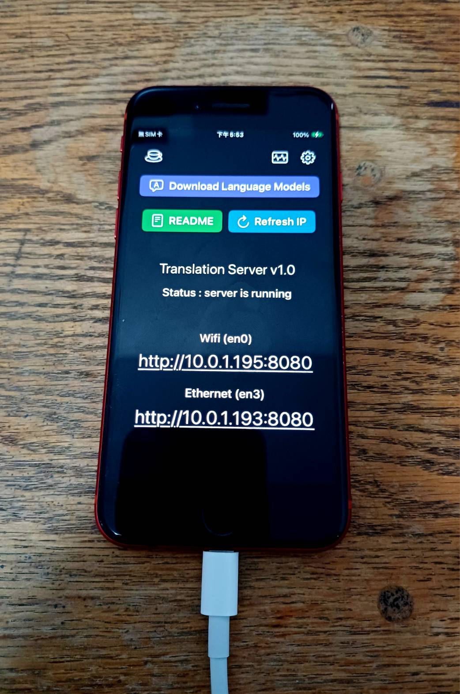

# 翻訳サーバー

翻訳サーバーは、あなたのiOSデバイスをローカル翻訳APIサーバーに変身させます。iOSのネイティブ翻訳フレームワークをベースに、このアプリは完全にオフラインの翻訳サービスを提供し、自動言語検出と多言語ペア翻訳をサポートします。クリーンなWeb APIインターフェースを通じて、開発者とユーザーは高品質な翻訳機能を任意のプロジェクトに簡単に統合でき、同時にデータプライバシーとセキュリティを確保します。

[App Store からダウンロード](https://apps.apple.com/us/app/translation-server/id6751807201)

[English](README.md) | **日本語** | [繁體中文](README.zh-TW.md) | [简体中文](README.zh-CN.md) | [한국어](README.ko.md) | [Français](README.fr.md)



## 機能

- 自動ソース言語検出
- 複数の翻訳ペアをサポート
- 簡単な統合のためのシンプルでクリーンなWeb API
- すべての処理がデバイス上で行われ、プライバシーとセキュリティを確保

## 使用方法

**`translate` API による翻譯**

1. アプリ内で必要な言語モデルをダウンロードしてください。
2. ソース言語を自動検出し、ターゲット言語を指定：
    ```
    curl -H "Accept: application/json" \
      -H "Content-Type: application/json" \
      -X POST http://<あなたのIP>:8080/translate \
      -d '{ "target": "en", "text": "こんにちは、世界" }'
    ```

3. ソース言語とターゲット言語を指定：
    ```
    curl -H "Accept: application/json" \
      -H "Content-Type: application/json" \
      -X POST http://<あなたのIP>:8080/translate \
      -d '{ "source": "zh-Hant", "target": "en", "text": "你好，世界" }'
    ```

4. Python例：
    ```python
    import requests

    url = "http://10.0.1.13:8080/translate"  # あなたのIPアドレスに置き換えてください

    headers = {
        "Accept": "application/json",
        "Content-Type": "application/json"
    }
    data = {
        "target": "en",
        "text": "こんにちは、世界"
    }
    response = requests.post(url, headers=headers, json=data)

    print("status code:", response.status_code)
    print("json response:", response.json())
    ```

5. JSONレスポンス形式：
    ```
    {
        "success":true,
        "message":"OK",
        "translated":"Hello, world",
        "source":"Japanese",
        "target":"English"
        "availability":"installed",
    }
    ```
    `translated` フィールドに翻訳されたテキストコンテンツが含まれています。

6. 言語一覧：
    ```
    "en": "英語",
    "en-US": "英語（アメリカ）",
    "en-GB": "英語（イギリス）",
    "zh-Hans": "中国語（簡体字）",
    "zh-Hant": "中国語（繁体字）",
    "ja": "日本語",
    "ko": "韓国語",
    "fr": "フランス語",
    "de": "ドイツ語",
    "es": "スペイン語",
    "pt": "ポルトガル語",
    "it": "イタリア語",
    "nl": "オランダ語",
    "ru": "ロシア語",
    "uk": "ウクライナ語",
    "pl": "ポーランド語",
    "tr": "トルコ語",
    "ar": "アラビア語",
    "hi": "ヒンディー語",
    "th": "タイ語",
    "vi": "ベトナム語",
    "id": "インドネシア語",
    ```

7. アプリが中断されることなく継続的に実行されるように、iOS [アクセスガイド](https://support.apple.com/ja-jp/111795)を有効にし、画面をオンに保ってください。