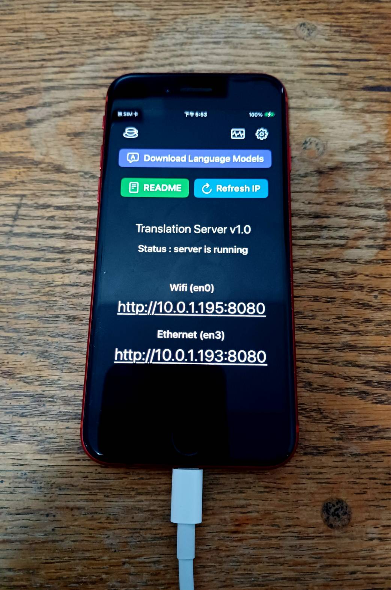

# Translation Server

Translation Server transforms your iOS device into a local translation API server. Based on iOS's native Translation framework, this app provides completely offline translation services with support for automatic language detection and multilingual translation pairs. Through a clean Web API interface, developers and users can easily integrate high-quality translation capabilities into any project while ensuring data privacy and security.

[Download from the App Store](https://apps.apple.com/us/app/translation-server/id6751807201)

**English** | [日本語](README.ja.md) | [繁體中文](README.zh-TW.md) | [简体中文](README.zh-CN.md) | [한국어](README.ko.md) | [Français](README.fr.md)



## Features

- Automatic source language detection
- Support for multiple translation pairs
- Simple and clean Web API for easy integration
- All processing stays on-device, ensuring privacy and security

## How to Use

**Translate via `translate` API**

1. Download the required language model in the app.
2. Automatically detect the source language and specify the target language:
    ```
    curl -H "Accept: application/json" \
      -H "Content-Type: application/json" \
      -X POST http://<YOUR IP>:8080/translate \
      -d '{ "target": "en", "text": "こんにちは、世界" }'
    ```

3. Specify source and target languages:
    ```
    curl -H "Accept: application/json" \
      -H "Content-Type: application/json" \
      -X POST http://<YOUR IP>:8080/translate \
      -d '{ "source": "zh-Hant", "target": "en", "text": "你好，世界" }'
    ```

4. Python example:
    ```python
    import requests

    url = "http://10.0.1.13:8080/translate"  # Replace with your IP address

    headers = {
        "Accept": "application/json",
        "Content-Type": "application/json"
    }
    data = {
        "target": "en",
        "text": "こんにちは、世界"
    }
    response = requests.post(url, headers=headers, json=data)

    print("status code:", response.status_code)
    print("json response:", response.json())
    ```

5. The JSON response looks like this:
    ```
    {
        "success":true,
        "message":"OK",
        "translated":"Hello, world",
        "source":"Japanese",
        "target":"English"
        "availability":"installed",
    }
    ```
    The `translated` field contains the translated text content.

6. Language list:
    ```
    "en": "English",
    "en-US": "English (United States)",
    "en-GB": "English (United Kingdom)",
    "zh-Hans": "Chinese (Simplified)",
    "zh-Hant": "Chinese (Traditional)",
    "ja": "Japanese",
    "ko": "Korean",
    "fr": "French",
    "de": "German",
    "es": "Spanish",
    "pt": "Portuguese",
    "it": "Italian",
    "nl": "Dutch",
    "ru": "Russian",
    "uk": "Ukrainian",
    "pl": "Polish",
    "tr": "Turkish",
    "ar": "Arabic",
    "hi": "Hindi",
    "th": "Thai",
    "vi": "Vietnamese",
    "id": "Indonesian",
    ```

7. To ensure the app runs continuously without interruption, please enable iOS [Guided Access](https://support.apple.com/en-us/111795) mode and keep the screen on.